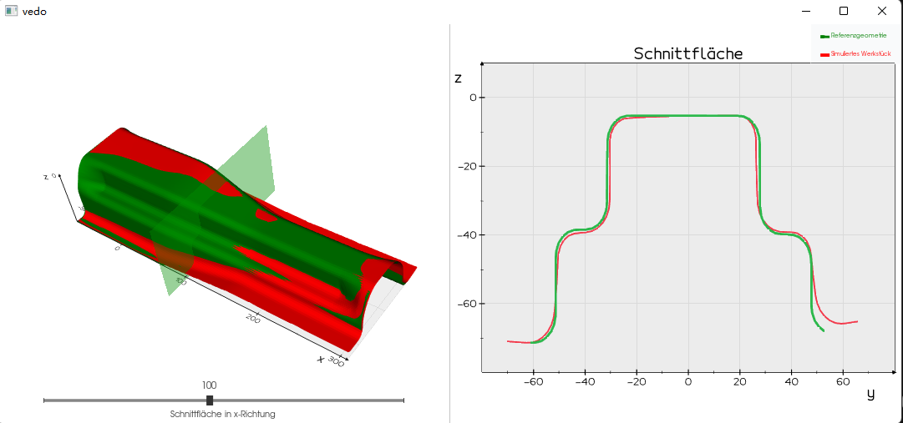

# Springback Compensation
Iterative FE Simulation for the Evaluation of an Innovative Deviation Compensation for Deep Drawn Components 

# Introduction:
Deep drawing is a manufacturing process used to create complex shapes and components from sheet metal. However, one of the challenges of this process is springback, which occurs when the metal material returns to its original shape after being stretched and formed. This can result in deviations from the desired shape of the component, making it difficult to achieve the desired precision and accuracy.

# Objective:
The objective of this project is to develop a method for compensating for springback in deep drawn components using reverse engineering and FEM simulation. The goal is to construct components with the desired shape, despite excessive spring back after deep drawing.

# Methods:
To accomplish this goal, we used CATIA V5 and the "vedo" Python package to optimize the 3D model of the component. We then built FEM simulation with AutoForm to predict the springback behavior of the material. We used 'vedo' and 'trimesh' to preprocess the mesh model and generate a compensated CAD model using B-Spline Approximation.

We calculated the shape deviation between the FEM result and the target component using the control points of B-spline, and then compensated for this deviation iteratively with an appropriate algorithm. We also created an interactive tool using "vedo" to identify deviations in component sections, providing an automated workflow process to improve productivity.

# Conclusion:
This project demonstrates a successful method for compensating for springback in deep drawn components using reverse engineering and FEM simulation. By using this approach, we were able to achieve the desired shape of the component despite excessive spring back after deep drawing. This method can be used to improve the precision and accuracy of deep drawn components, and can be easily integrated into existing manufacturing processes to improve productivity.

